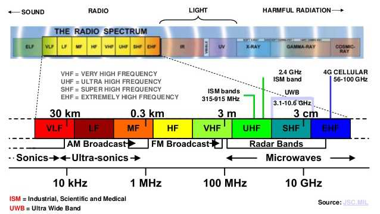
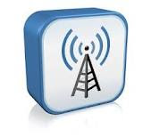
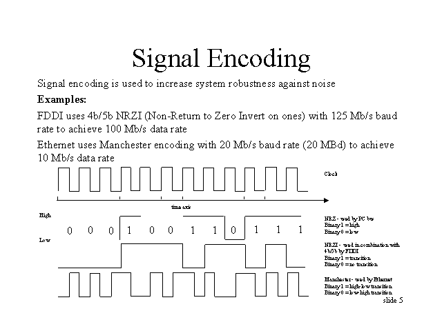

## # MACAM MACAM SIGNAL

## A. Pengertian Frekuensi Radio

Secara umum definisi atau pengertian frekuensi radio adalah gelombang elektromagnetik yang disebarkan lewat antena. Gelombang radio ini mempunyai frekuensi yang berbeda beda sehingga butuh penyetelan frekuensi tertentu yang sesuai dengan penerima radio atau radio receiver agar bisa memperoleh sinyal. Sedangkan frekuensi radio atau RF sendiri berkisar antara 3 KHz hingga 300 GHz.

Radio frekuensi atau RF atau gelombang radio merupakan unit pengukuran frekuensi gelombang yang sesuai dengan satu siklus per detik. Gelombang elektromagnetik pada daerah spektrum bisa ditransmisikan dengan memakai generator arus bolak balik yang terjadi karena satelit.

Gelombang radio tersebut adalah jenis dari radiasi elektromagnetik dengan panjang gelombang lebih besar namun lebih jarang jika dibandingkan dengan radiasi inframerah. Sama seperti seluruh gelombang elektromagnetik lain yang bergerak dengan kecepatan cahaya pada ruang hampa, gelombang ini bisa dihasilkan secara alami oleh petir dan juga dari benda astronomi lain.

Gelombang radio bisa dihasilkan dari penyiaran baik televisi atau radio, radio amatir, telepon selular, radar, komunikasi satelit, jaringan komputer serta aplikasi lain. Gelombang elektromagnetik juga disebut dengan gelombang radio yang lebih dikenal dengan frekuensi radio. Gelombang radio ini bisa dihasilkan arus listrik yang bervariasi dengan cepat yakni frekuensi tinggi arus listrik pada konduktor seperti antena.
Dalam aplikasnya, siaran radio dan juga siaran televisi yang kita nikmati sekarang ini ada di pengalokasian frekuensi seperti dibawah ini:
Radio AM (Amplitude Modulation): 535 kHz – 1.7 MHz
Short Wave Radio (Radio Gelombang Pendek): 5.9 MHz – 26.1 MHz
Radio CB (Citizen Band): 26.96 MHz – 27.41 MHz
Stasiun Televisi: 54 MHz – 88 MHz (kanal 2 ~ 6)
Radio FM (Frequency Modulation): 88 MHz – 108 MHz
Stasiun Televisi: 174 MHz – 220 MHz (kanal 7 ~ 13)
Spektrum frekuensi radio merupakan susunan dari pita frekuensi radio yang memiliki frekuensi lebih kecil dari 3000 GHz sebagai satuan getaran atau ruang udara dan antariksa. Pengalokasian spektrum frekuensi radio di Indonesia mengacu ke alokasi frekuensi radio internasional untuk region 3 atau wilayah 3 sama seperti peraturan radio yang sudah ditetapkan International Telecommunication Union [ITU] atau Himpunan Telekomunikasi Internasional.
Penetapan Jalur atau spektrum frekuensi radio yang menentukan berguna untuk menghindari terjadinya gangguan atau interference serta untuk menetapkan protokol untuk keserasian antara pemancar dan juga penerima.

## Macam Jenis Frekuensi Radio
Untuk kehidupan sehari hari di beberapa peralatan yang digunakan, ada beberapa jenis frekuensi radio yang paling banyak digunakan, yakni:

Pengertian Elektromagnetik Macam Jenis, Sifat dan Sumbernya
Very Low Frequency VLF: Frekuensi <30 kHz dengan panjang gelombang >10 km.
Low Frequency LF: Frekuensi 30 – 300 kHz dengan panjang gelombang 1 – 10 km.
Medium Frequency MF: Frekuensi 300 – 3000 kHz dengan panjang gelombang 100 – 1000 m.
High Frequency HF: 3 – 30 MHz dengan panjang gelombang 10 – 100 m.
Very High Frequency VHF: Frekuensi 30 – 300 MHz dengan panjang gelombang 1 – 10 m
Ultra High Frequency UHF: Frekuensi 300 – 3000 MHz dengan panjang gelombang 10 – 100 cm.
Super High Frequency SHF: Frekuensi 3 – 30 GHz dengan panjang gelombang 1 – 10 cm.
Extremely High Frequen EHF: Frekuensi 30 – 300 GHz dengan panjang gelombang 1 – 10 mm.
C. Sinyal Radio Frekuensi
Sinyal radio frekuensi atau RF adalah gelombang elektromagnetik yang dipakai sistem komunikasi untuk mengirimkan informasi lewat udara dari satu titik menuju titik lainnya. Sinyal RF ini sudah digunakan selama bertahun tahun yang juga memberikan cara mengirim musik di radio FM dan juga video di TV. Pada kenyataannya, sinyal RF juga menjadi sarana umum dalam mengirim data lewat jaringan wireless.

D. Sifat Sinyal Radio Frekuensi
Sinyal radio frekuensi memiliki sifat yang merambat di antara pemancar pengirim dan juga penerima. Sinyal yang dipasok di antena mempunyai amplitudo, frekuensi serta interval. Beberapa sifat ini akan berubah ubah setiap saat untuk mempresentasikan informasi. Amplitudo mengindikasikan kekuatan sintal dan ukurannya umumnya berupa energi yang dianalogikan pada jumlah usaha yang dipakai seseorang ketika mengendarai sepeda untuk mencapai titik tertentu.

Energi dalam konteks sinyal elektromagnetik menggambarkan jumlah energi yang dibutuhkan untuk mendorong sinyal di jarak tertentu. Pada saat energi meningkat, maka jaraknya juga akan meningkat. Ketika sinyal radio merambat lewat udara, maka sinyal ini akan kehilangan amplitudo. Aabila jarak di antara pengirim dan juga penerima bertambah, maka amplitudo sinyal akan menurun secara eksponensial.

Di lingkungan terbuka yakni tidak terdapat rintangan, maka sinyal radio frekuensi bisa mengalami free space loss yakni bentuk dari pelemahan. Kondisi ini mengakibatkan sinyal yang sudah dimodulasi akan melemah secara eksponensial ketika sinyal merambat semakin jauh dari antena. Untuk itulah, sinyal harus punya cukup energi agar bisa mencapai jarak di mana tingkat sinyal bisa diterima sesuai dengan yang diperlukan receiver.

## WI-FI  
 Wi-Fi adalah sebuah teknologi terkenal yang memanfaatkan peralatan elektronik untuk bertukar data secara nirkabel (menggunakan gelombang radio) melalui sebuah jaringan komputer, termasuk koneksi Internet berkecepatan tinggi. Wi-Fi Alliance mendefinisikan Wi-Fi sebagai "produk jaringan wilayah lokal nirkabel (WLAN) apapun yang didasarkan pada standar Institute of Electrical and Electronics Engineers (IEEE) 802.11". Meski begitu, karena kebanyakan WLAN zaman sekarang didasarkan pada standar tersebut, istilah "Wi-Fi" dipakai dalam bahasa Inggris umum sebagai sinonim "WLAN".
 

Sebuah alat yang dapat memakai Wi-Fi (seperti komputer pribadi, konsol permainan video, telepon pintar, tablet, atau pemutar audio digital) dapat terhubung dengan sumber jaringan seperti Internet melalui sebuah titik akses jaringan nirkabel. Titik akses (atau hotspot) seperti itu mempunyai jangkauan sekitar 20 meter (65 kaki) di dalam ruangan dan lebih luas lagi di luar ruangan. Cakupan hotspot dapat mencakup wilayah seluas kamar dengan dinding yang memblokir gelombang radio atau beberapa mil persegi — ini bisa dilakukan dengan memakai beberapa titik akses yang saling tumpang tindih.

 Kelebihan Wi-fi :
Memungkinkan LAN untuk digunakan tanpa kabel, biasanya mengurangi biaya penyebaran jaringan dan ekspansi. Ruang di mana kabel tidak dapat dijalankan, seperti area outdoor dan bangunan bersejarah, dapat menggunakan LAN Wireless.
Harga Wi-Fi terus turun, membuat Wi-Fi merupakan pilihan yang sangat ekonomis mengenai jaringan
Produk Wi-Fi tersedia di pasar secara luas.
Wi-Fi jaringan dukungan roaming, di mana sebuah stasiun klien mobile seperti komputer laptop dapat berpindah dari satu jalur akses ke jalur akses yang lainnya
Wi-Fi adalah perangkat standar global. Tidak seperti operator selular, klien Wi-Fi yang sama bekerja di berbagai negara di seluruh dunia.
Tersebar Luas di lebih dari 250.000 tempat umum, jutaan rumah, perusahaan dan universitas di seluruh dunia.
Protokol baru untuk Kualitas Layanan (WMM) dan mekanisme power saving (WMM Power Save) membuat Wi-Fi lebih sesuai untuk aplikasi yang latency-sensitif (seperti suara dan video) dan perangkat kecil berbentuk-faktor.

Kekurangan Wi-fi :
Penyaluran Gelombang dan keterbatasan operasional yang tidak konsisten di seluruh dunia.
Konsumsi Power yang cukup tinggi jika dibandingkan dengan beberapa standar lainnya, membuat masa pakai baterai berkurang dan panas.
Jaringan WiFi memiliki rentang yang terbatas. Sebuah router WiFi rumah mungkin memiliki kisaran 45m (150ft) indoor dan 90 juta (300ft) di luar rumah.
WiFi menggunakan spektrum 2.4GHz tanpa izin, dimana yang sering bertabrakan dengan perangkat lain seperti Bluetooth, oven microwave, telepon tanpa kabel, atau perangkat pengirim video, banyak lainnya. Hal ini dapat menyebabkan penurunan kinerja.
Jalur akses dapat digunakan untuk mencuri informasi pribadi dan rahasia ditransmisikan dari konsumen WiFi.
Intervensi pada jalur akses tertutup atau dienkripsi dengan jalur akses terbuka yang lainnya pada saluran yang sama atau dekat dapat mencegah akses ke jalur akses yang terbuka oleh orang lain di daerah tersebut. Ini menimbulkan masalah tinggi di daerah kepadatan tinggi seperti blok apartemen besar di mana banyak penduduk beroperasi poin akses WiFi.
Jalur akses gratis dapat digunakan oleh orang tak dikenal dan berbahaya untuk melakukan serangan yang akan sangat sulit untuk melacak di luar jalur akses pemilik.

## BLUETOOTH
Bluetooth adalah spesifikasi industri untuk jaringan kawasan pribadi (personal area networks atau PAN) tanpa kabel. Bluetooth menghubungkan dan dapat dipakai untuk melakukan tukar-menukar informasi di antara peralatan-peralatan. Spesifiksi dari peralatan Bluetooth ini dikembangkan dan didistribusikan oleh kelompok Bluetooth Special Interest Group. Bluetooth beroperasi dalam pita frekuensi 2,4 Ghz dengan menggunakan sebuah frequency hopping traceiver yang mampu menyediakan layanan komunikasi data dan suara secara real time antara host-host bluetooth dengan jarak terbatas.Kelemahan teknologi ini adalah jangkauannya yang pendek dan kemampuan transfer data yang rendah.

 Kelebihan Bluetooth :
Bluetooth dapat menembus dinding, kotak, dan berbagai rintangan lain walaupun jarak transmisinya hanya sekitar 30 kaki atau 10 meter
Bluetooth tidak memerlukan kabel ataupun kawat
Bluetooth dapat mensinkronisasi basis data dari telepon genggam ke komputer
Dapat digunakan sebagai perantara modem

Kekurangan Bluetooth : 
Penyaluran Gelombang dan keterbatasan operasional yang tidak konsisten di seluruh dunia.
Konsumsi Power yang cukup tinggi jika dibandingkan dengan beberapa standar lainnya, membuat masa pakai baterai berkurang dan panas.
Jaringan WiFi memiliki rentang yang terbatas. Sebuah router WiFi rumah mungkin memiliki kisaran 45m (150ft) indoor dan 90 juta (300ft) di luar rumah.
WiFi menggunakan spektrum 2.4GHz tanpa izin, dimana yang sering bertabrakan dengan perangkat lain seperti Bluetooth, oven microwave, telepon tanpa kabel, atau perangkat pengirim video, banyak lainnya. Hal ini dapat menyebabkan penurunan kinerja.
Jalur akses dapat digunakan untuk mencuri informasi pribadi dan rahasia ditransmisikan dari konsumen WiFi.
Intervensi pada jalur akses tertutup atau dienkripsi dengan jalur akses terbuka yang lainnya pada saluran yang sama atau dekat dapat mencegah akses ke jalur akses yang terbuka oleh orang lain di daerah tersebut. Ini menimbulkan masalah tinggi di daerah kepadatan tinggi seperti blok apartemen besar di mana banyak penduduk beroperasi poin akses WiFi.
Jalur akses gratis dapat digunakan oleh orang tak dikenal dan berbahaya untuk melakukan serangan yang akan sangat sulit untuk melacak di luar jalur akses pemilik. 

##  INFRARED
Infrared (IR) cahaya adalah radiasi elektromagnetik dengan panjang gelombang lebih panjang daripada cahaya tampak, membentang dari tepi merah nominal dari spektrum yang terlihat pada 0,74 mikrometer (pM) menjadi 300 pM. Rentang panjang gelombang sesuai dengan rentang frekuensi sekitar 1-400 THz, dan termasuk sebagian besar radiasi termal yang dipancarkan oleh benda-benda di dekat suhu kamar. Cahaya inframerah yang dipancarkan atau diserap oleh molekul ketika mereka mengubah rotasi-getaran gerakan mereka. Adanya radiasi inframerah pertama kali ditemukan pada 1800 oleh astronom William Herschel.

Kelebihan Infrared :
Bebas Pulsa.
Bisa dilakukan kapan saja karena tak menggunakan sinyal.
Penggunaannya sangat mudah karena termasuk alat yang sederhana.

Kekurangan Infrared :
Kedua lubang Inframerah harus berhadapan satu sama lain, sehingga agak menyulitkan kita dalam mentransfer data.
Bahaya bagi mata, Jadi JANGAN sekali-kali menyorotkan Inframerah ke mata anda.
Seperti dikatakan di atas, banyak ponsel keluaran terbaru yang tidak dilengkapi Inframerah. Sehingga apabila ponsel kita adalah ponsel keluaran lama yang hanya dilengkapi Inframerah tanpa dilengkapi Bluetooth, kita tidak dapat meminta data dari ponsel terbaru tersebut.

## Encoding

Kode atau password dalam komunikasi adalah aturan untuk mengubah suatu informasi(sebagai contoh, suatu surat, kata, atau frasa) menjadi bentuk atau representasi lain, yang tidakharus dalam bentuk yang sama. Dalam komunikasi dan pemrosesan informasi, pengkodean atau penyandian (encoding) adalah proses konversi informasi dari suatu sumber (objek)menjadi data, yang selanjutnya dikirimkan ke penerima atau pengamat, seperti pada sistem pemrosesan data.

Pengertian encoding dalam komunikasi berarti tindakan pemberian arti simbol-simbol pada pemikiran. Misalnya: memutuskan kata kata mana yang akan dikatakan atau dituliskan.Proses penyandian adalah tindakan pemilihan simbol-simbol untuk pemikiran. Penegrtian laindari encoding itu sendiri adalah proses untuk mengubah sinyal ke dalam bentuk yangdioptimasi untuk keperluan komunikasi data dan penyimpanan data. Kedua hal inilah yang saling mendukung untuk mengubah bentuk sinyal sehingga bisa disalurkan dari pengirim ke penerima. Dalam hal modulasi, komunikasi data ada yang menggunakan sinyal digital. Tetapikomunikasi ini memiliki kelemahan yaitu jarak tempuh yang tidak terlalu besar akibat pengaruh noise berupa redaman yang terjadi pada media transmisi. Sedangkan komunikasi datamenggunakan sinyal analog jarak tempuhnya akan menjadi lebih besar.

Dapat disimpulkan bahwa encoding adalah suatu proses pengkodean atau penyandian terhadap suatu informasi dari suatu sumber data, dengan kata lain maksud dari penyandian itusendiri adalah proses untuk mengubah sinyal ke dalam bentuk yang dioptimasi untuk keperluantransmisi data atau (penyimpanan data) atau dalam komunikasi berarti tindakan pemberian artisimbol-simbol pada pemikiran. Misalnya: memutuskan kata kata mana yang akan dikatakan atau dituliskan. Proses penyandian adalah tindakan pemilihan simbol-simbol untuk pemikiran
